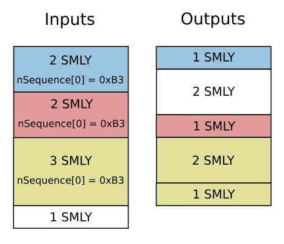

The Protocol
============

The colorvote system is based on the idea of colored coins, a class of methods
used to represent real world assets on the blockchain. Colored coins work by
encoding additional information in transactions, so that the transaction will
represent the issuing or transfer of a given asset. This is usually done with
the :code:`OP_RETURN` scripting code or the unused :code:`nSequence` field in
transaction inputs.

Transaction Types
-----------------

The colorvote protocol uses the :code:`nSequence` field to identify votes on the
blockchain. The field is 4 bytes long and has the value :code:`0xFFFFFFFF` for
normal transactions. The first byte (least significant) is used to tag the
transaction type. The other three bytes differ by transaction type and are
described below.

Colorvote introduces three different types of transactions depending on their
role. The type is tagged in the least significant byte of the nSequence field of
the first input of a transaction.

.. table:: Types of transactions
   :widths: auto
   :align: center

   =============== =========== =======
   Type            Hexadecimal Decimal
   =============== =========== =======
   Identification  0xB1        177
   Issuance        0xB2        178
   Transfer        0xB3        179
   =============== =========== =======

Identification Transaction
##########################

An identification transaction is used to identify a colored address. A colored
address should only submit one identification transaction. Anyone can then
search the blockchain for such a transaction to see what colors have been
issued, in other words, what elections have been held on the blockchain.

The first input of a identification transaction should come from the address
that will become the color (also called election address), and it should have
:code:`0xB1` encoded in the least significant byte of :code:`nSequence`. 

The second least significant byte should contain the voting coin value :math:`V`
(the currency value of one vote) where the four least significant bytes are the
multiplier :math:`K` and the four most significant bytes are the exponent
:math:`N`. The voting coin value is then 

.. math::
    V = k\cdot10^N \,\text{satoshi}

.. table:: Examples of vote unit encoding
   :widths: auto
   :align: center

   =============== === === ===========
   nSequence[1]    k   N   Voting coin
   =============== === === ===========
   0x81            1   8   :math:`10^8` sat
   0x7A            10  7   :math:`10^8` sat
   0x6F            15  6   :math:`1.5\cdot10^7` sat
   0xA2            2   10  :math:`2\cdot10^{10}` sat
   =============== === === ===========

The first output should be a P2PKH output, either back to the same address or
somewhere else. There may also be an optional second output that contains an
:code:`OP_RETURN` script with some metadata about the color (i.e. link to
election web page).

The colorvote protocol gives election authorities flexibility over some election
properties. For example the authority might decide that only votes sent before a
deadline will be counted, or that votes must use a commitment scheme, or that
only a specific set of candidate addresses will be valid. It's a good idea to
put a link in the election metadata with information about such details.

Issuance Transaction
####################

An issuance transaction is used to create new colored voting coins. This kind of
a transaction should have only one input from an address that has already made
an identification transaction. This input should have :code:`0xB2` in the least
significant byte of :code:`nSequence`.

The transaction can have any number of outputs but they should all be P2PKH. The
output values should be a multiple of the voting unit (default 1 BTC) or else
they will be rounded down.

Transfer Transaction
####################

A transfer transaction is used to transfer votes between addresses. A transfer
transaction can have multiple inputs and outputs transferring multiple colors in
a single transaction. As only the inputs can be traced to an issuance
transaction to determine the color, we will use a scheme known as order-based
coloring (OBC) to determine the colors of the outputs from the inputs.

Each input that is transferring colored coins should have :code:`0xB3` in the
least significant byte of :code:`nSequence`. An output is considered to receive
the colored coins if it is covered by the input when all inputs and outputs are
represented as segments on a line with each 

   Order-based coloring determines output colors by the colors of the inputs
   that cover them.

The figure above shows what the inputs and outputs of a transfer transaction
might look like. The first output inherits the color of the first input, as it
is covered by it. The second output inherits no color however, as it is not
covered by a single input.

To account for the transaction fee, an additional input from an uncolored UTXO
will need to be supplied. On the figure it is shown as 1 SMLY in the last
output.

The colored outputs may also be accompanied by an :code:`OP_RETURN` script
output. If output :math:`n` is colored then output :math:`n+1` belongs to it
if it contains OP_RETURN data. This will be used for sending commitment
transactions.

Commitment Scheme
-----------------

With most colored coins protocols, the balance of any address can be calculated
at any time. This might be undesired for voting purposes, as the votes should
only be countable after everyone has voted. To address this we introduce a
cryptographic commitment scheme. Using this scheme, votes are cast in two steps
with one transaction for each step.

The first one is a commitment transaction that contains a commitment to a chosen
recipient while keeping it hidden from others. The second one is a reveal
transaction that contains a key to make the commitment visible to everyone. This
way all votes are final once everyone has sent commitment transactions, but the
votes can only be counted after everyone has sent reveal transactions.

The manager of an election should specify a deadline for sending commitments,
and a deadline for sending reveals. This way commitments are only valid if sent
before the first deadline, and reveals are only valid if sent between the two
deadlines.

Commitment Transaction
######################

A commitment transaction is a transfer transaction where a colored coin is not
transferred to a candidate but to an address that will later send the final
vote. In most cases it will probably be sent back to the same owner (can be same
address) which will later send a reveal transaction.

To add a commitment to a transfer transaction, we add an `OP_RETURN` output
after the output that should contain the commitment. To create a commitment to
an address X (with a public key P), we generate a random 256 bit number M and
then calculate SHA256(P||M) where || means bitwise or.

.. math::

    C = \text{SHA256} (P || M)

Reveal Transaction
##################

A reveal transaction is a transfer transaction where a colored voting coin from
an UTXO with a commitment is sent to its final destination (the address of a
candidate). To make a valid reveal transaction we add an `OP_RETURN` after the
output that goes to the candidate. It should contain the random number M that
was generated for the commitment.

When counting votes we only consider UTXO's where the commitment matches the
reveal.

Election Example
----------------

Distributed Authority
---------------------

To improve trust, the election authority needs to be distributed between two or
more entities.
