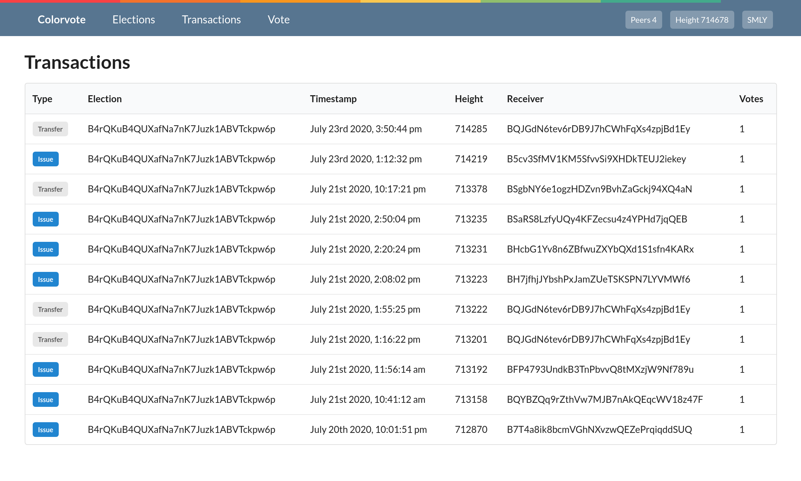

Web Service
===========

The web server is a useful tool for exploring elections on the blockchain. It
shows all election transactions on the blockchain and vote counts for elections.
It is built as a REST API with a frontend written in React. External services
can use the API to get election details without running a wallet.

   Screenshot of the web server frontend

Installation
------------

It is recommended to run the service in docker containers. The GitHub repository
contains docker configuration, to install the service clone the GitHub repo and
run the following inside it

.. code:: bash

    $ docker-compose up -d --build

You will need to configure the wallet with :code:`txindex=1` and give the
backend access to the RPC interface.

API Calls
---------
